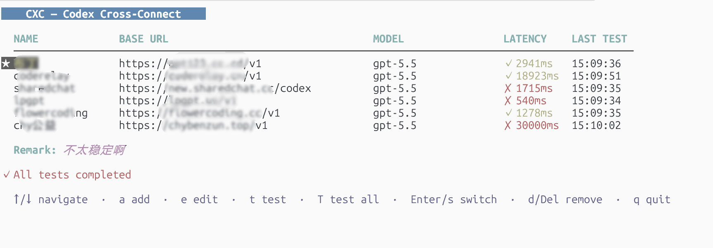

# CXC — Codex Cross-Connect

> Quickly switch API relay endpoints for AI coding tools like Codex and Claude.

[](https://golang.org)
[](LICENSE)



CXC is a CLI/TUI tool for managing multiple API relay endpoint configurations for AI coding tools. Instead of manually editing TOML and JSON config files, use `cxc` to add, test, and switch between providers in seconds.

## Features

- **CLI mode** — scriptable subcommands for automation
- **TUI mode** — full-screen interactive interface (launch with `cxc`)
- **Provider management** — add, list, test, switch, remove
- **Connectivity test** — real chat completion request with latency measurement
- **Safe switching** — `.bak` backups created before any config file is modified
- **Codex integration** — automatically updates `~/.codex/config.toml` and `~/.codex/auth.json`

## Installation

### One-click Installer (Linux / macOS)

```bash
curl -fsSL https://raw.githubusercontent.com/zhang3say/cxc/main/install.sh | bash
```

### Go Install

```bash
go install github.com/zhang3say/cxc@latest
```

### Build from source

```bash
git clone https://github.com/zhang3say/cxc
cd cxc
go build -o cxc .
```

## Usage

### TUI mode

```bash
cxc
```

Launch the interactive full-screen TUI. Keyboard shortcuts:

| Key | Action |
|-----|--------|
| `↑`/`↓` | Navigate providers |
| `a` | Add a new provider |
| `e` | Edit highlighted provider |
| `t` | Test the highlighted provider |
| `T` | Test all providers concurrently |
| `Enter`/`s` | Switch to highlighted provider |
| `d`/`Delete` | Remove highlighted provider |
| `q`/`Esc` | Quit |

### CLI mode

```bash
# Add a provider (interactive if flags omitted)
cxc provider add --name my-relay \
  --base-url https://api.example.com/v1 \
  --api-key sk-xxx \
  --model gpt-4

# List all providers
cxc provider list

# Test a provider's connectivity
cxc provider test               # tests active provider
cxc provider test my-relay      # tests named provider
cxc provider test --all         # tests all saved providers concurrently (or -a)

# Switch active provider
cxc provider switch my-relay

# Remove a provider
cxc provider remove my-relay
```

## How it works

CXC stores its own provider list at `~/.config/cxc/config.yaml` (0600 permissions).

When you switch providers, CXC updates:
- `~/.codex/config.toml` — sets `model`, `model_providers.codex.base_url`, `wire_api`
- `~/.codex/auth.json` — sets `OPENAI_API_KEY`

Both files are backed up as `.bak` before any write.

## Configuration

CXC's own config at `~/.config/cxc/config.yaml`:

```yaml
active: my-relay
providers:
  - name: my-relay
    base_url: https://api.example.com/v1
    api_key: sk-xxx
    model: gpt-4
    wire_api: responses
```

## Architecture

- **CLI**: [Cobra](https://github.com/spf13/cobra) — subcommand routing
- **TUI**: [Bubble Tea](https://github.com/charmbracelet/bubbletea) — Elm-architecture TUI
- **TOML**: [pelletier/go-toml](https://github.com/pelletier/go-toml) — structure-preserving mutation
- **Config**: YAML via [gopkg.in/yaml.v3](https://gopkg.in/yaml.v3)

See [docs/adr/](docs/adr/) for architectural decision records.

## License

MIT
