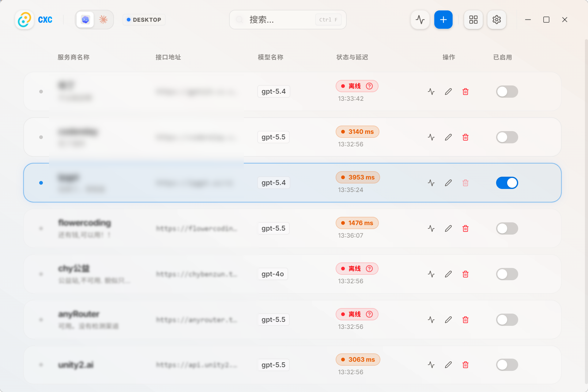

# CXC — Code Cross-Connect

[简体中文](README.md) | English

> Quickly switch API relay endpoints for AI coding tools like Codex and Claude.

[](https://www.rust-lang.org)
[](LICENSE)



CXC is a desktop GUI application for managing multiple API relay endpoint configurations for AI coding tools. Instead of manually editing complex TOML and JSON configuration files, use CXC to easily add, test, and switch between providers within an intuitive graphical interface.

## Features

- **Intuitive GUI** — Elegant translucent glassmorphism design with a dark mode theme for a premium user experience.
- **Independent Environments (App / WSL)** — Track the Active Provider independently for Windows Desktop (App) and WSL CLI sources, allowing for seamless context switches.
- **Provider Management** — Easily add, edit, test, delete, and add remarks to providers.
- **Model Discovery** — Automatically fetch and pick available models from a provider's endpoint instead of typing them manually.
- **Connectivity Test** — Performs a real API connectivity request (not just a network ping) and measures latency to ensure the provider is functional.
- **System Tray** — Sits in the system tray for quick-access Codex provider switching without opening the main window.
- **Safe Switching** — Automatically creates `.bak` backups of target config files before applying any changes.
- **Multi-Tool Integration** — Automatically manages configurations and seamlessly integrates with Codex (`~/.codex/config.toml`) and Claude CLI (`~/.claude/settings.json`).

## Setup and Development

### Running Development Server

To run the desktop application locally in development mode:

```bash
# Clone the repository
git clone https://github.com/zhang3say/cxc
cd cxc

# Navigate to the desktop directory and install dependencies
cd cxc-desktop
npm install

# Start development environment
npm run tauri dev
```

### Production Build

To build production-ready packages:

```bash
cd cxc-desktop
npm run tauri build
```

The compiled binaries and installers will be saved in `cxc-desktop/src-tauri/target/release/bundle/`.

## How it works

CXC stores its own provider list and settings in the system-specific config directory:
- Windows: `%USERPROFILE%\.config\cxc\config.yaml`
- Linux / WSL: `~/.config/cxc/config.yaml`

When switching providers, CXC updates:
- **Codex** — Updates `config.toml` (sets model, base_url, wire_api) and `auth.json` (sets API Key) in the Codex config directory.
- **Claude CLI** — Updates the `env` object (sets API Key, Base URL, and optional model mappings) in `settings.json`.

Before making any modifications, both config files are automatically backed up as `.bak` files.

## Architecture

- **Backend (Rust)**: Built on [Tauri](https://github.com/tauri-apps/tauri) (v2) and powered by [Tokio](https://github.com/tokio-rs/tokio) and [Reqwest](https://github.com/seanmonstar/reqwest) for highly concurrent, non-blocking API tests and file operations.
- **Frontend (React)**: Developed with React 19, TypeScript, and [Vite](https://github.com/vitejs/vite). Styled with [Tailwind CSS v4](https://tailwindcss.com) and [Radix UI](https://www.radix-ui.com) for a responsive, modern, and polished interface.
- **Format-Preserving AST Mutation**: Employs [toml_edit](https://github.com/toml-rs/toml) when editing Codex TOML config files, ensuring all original formatting and comments are preserved.

See [docs/adr/](docs/adr/) for architectural decision records.

## Community

This repo has been shared as open source on [Linux.do](https://linux.do/).

## License

MIT

